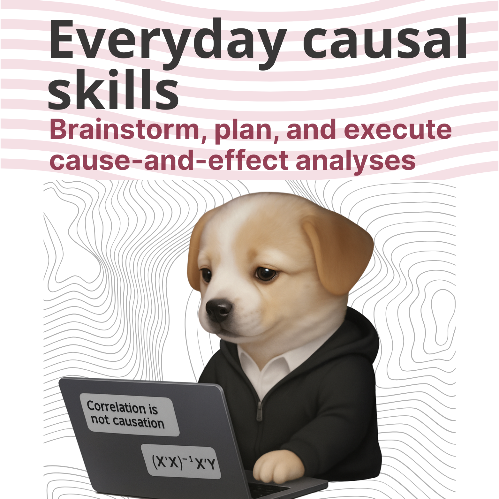

[🇺🇸  English](README.md) | 🇧🇷  **Português (BR)**

# everyday-causal-skills

<p align="center">
  
</p>

> Use para pensar em problemas causais, planejar sua análise e implementá-la: conceitualmente ou em R e Python.

Plugin de inferência causal para agentes de IA. Descreva um problema em linguagem natural e ele ajuda você a escolher o método, verificar premissas, escrever a análise em R ou Python e validar os resultados. Para profissionais que querem um workflow estruturado e para quem está aprendendo junto com [o livro](https://www.everydaycausal.com/).

**Funciona com:** Claude Code · Gemini CLI · GitHub Copilot CLI · Codex CLI · Cursor

**Para quem é:** Qualquer pessoa que precise medir se algo realmente funcionou, como times de Marketing e growth; Product managers e analistas de BI; Cientistas de dados; Times de revenue e operações; Pesquisadores de políticas públicas; Estudantes e autodidatas.

## O que este plugin faz por você

O plugin funciona em cinco etapas, desde refinar a pergunta que você quer responder até escrever o relatório. Você pode começar por qualquer uma.

```
→ Descreva seu problema
→ Receba uma recomendação de método
→ Verifique premissas e estruture a análise
→ Teste a robustez dos resultados
→ Escreva o relatório executivo
```

### Exemplo 1: Planejando um teste A/B

Um time de e-commerce redesenhou a página de checkout e quer saber se isso aumenta a conversão antes de liberar para todo mundo. Eles não sabem por quanto tempo o teste precisa rodar.

> **Você:** `/causal-experiments` Redesenhamos a página de checkout e queremos fazer um teste A/B para saber se aumenta a conversão. Por quanto tempo precisamos rodar o experimento?

O plugin faz algumas perguntas em linguagem simples: qual é a taxa de conversão atual, quantos visitantes vocês recebem por semana e qual é a menor melhoria que justificaria o redesign. A partir das respostas, ele calcula o tamanho de amostra necessário e diz quantas semanas o teste precisa rodar para detectar essa diferença de forma confiável.

Depois, ele sinaliza decisões de design que você talvez não tenha pensado — como se deve aleatorizar por visitante ou por sessão, e como lidar com usuários que veem as duas versões durante o teste.

> **Você:** Podemos aleatorizar por visitante usando um cookie. E os usuários que abandonam e voltam depois?

Ele te guia por esses casos, escreve o código de análise em R ou Python e inclui as verificações necessárias: diagnósticos de balanceamento para garantir que os grupos são comparáveis e um plano de análise pré-registrado para evitar que você busque resultados depois do fato.

Quando o teste é lançado, a análise já está pronta. Quando os dados chegam, você roda o código e tem a resposta.

### Exemplo 2: Medindo o impacto de um programa de fidelidade

Uma empresa de varejo lançou um programa de fidelidade em 12 das suas 50 lojas e quer saber se as compras recorrentes realmente aumentaram — ou se as lojas que receberam o programa já estavam em tendência de alta.

> **Você:** `/causal-planner` Lançamos um programa de fidelidade em 12 lojas há três meses. As outras 38 ainda não receberam. Quero saber se as compras recorrentes aumentaram por causa do programa.

O plugin pergunta sobre a estrutura dos dados — há quanto tempo os registros existem, se as 12 lojas foram escolhidas de alguma forma específica e qual resultado você está acompanhando. Com base nas respostas, recomenda diferenças em diferenças e explica por quê: você tem grupos de tratamento e controle com dados antes e depois do lançamento.

> **Você:** `/causal-did` Tenho taxas semanais de compra recorrente para todas as 50 lojas nos últimos 18 meses.

A skill verifica se as lojas tratadas e não tratadas seguiam tendências semelhantes antes do programa ser lançado — a premissa-chave que sustenta o método. Ela escreve o código de estimação em R ou Python, roda testes placebo e de robustez e sinaliza problemas antes de você perder tempo com resultados que não se sustentam.

Com a estimativa em mãos, `/causal-auditor` testa a análise: algo além do programa poderia explicar a diferença? As 12 lojas foram escolhidas de um jeito que enviesaria o resultado? Você recebe uma lista de ameaças para endereçar antes de apresentar os achados.

## Skills

| Skill | Finalidade |
|---|---|
| `/causal-planner` | Descreva uma questão causal em linguagem natural e receba uma recomendação de método com plano de análise |
| `/causal-dag` | Mapeia relações causais, encontra conjuntos de ajuste, detecta controles ruins |
| `/causal-experiments` | Desenhe e analise RCTs e testes A/B (análise de poder, verificação de aleatorização, diagnóstico de balanceamento) |
| `/causal-did` | Diferenças em diferenças com suporte para adoção escalonada, TWFE e estudos de evento |
| `/causal-iv` | Estimação por variáveis instrumentais com 2SLS, diagnóstico de instrumentos fracos e verificação de exclusão |
| `/causal-rdd` | Regressão descontínua sharp e fuzzy com seleção de bandwidth e testes de manipulação |
| `/causal-sc` | Controle sintético com ponderação de doadores, diagnóstico de ajuste pré-tratamento e testes placebo |
| `/causal-matching` | Matching por escore de propensão, IPW e estimadores duplamente robustos com diagnóstico de balanceamento |
| `/causal-timeseries` | Séries temporais interrompidas e CausalImpact com validação pré-período |
| `/causal-auditor` | Stress-test de qualquer análise finalizada contra cinco categorias de ameaças à validade |
| `/causal-exercises` | Pratique com dados simulados com ground truth conhecido e receba feedback sobre sua abordagem |

> **Uma nota sobre `/causal-dag`:** Esta skill é fundamentalmente diferente das demais. Uma skill como `/causal-did` recebe um estimando bem definido e gera código de estimação correto — "correto" é claro. `/causal-dag` recebe o seu conhecimento de domínio e ajuda a estruturá-lo em um grafo formal — "correto" é muito mais difícil de definir. Um DAG codifica *premissas*, não fatos. Cada seta que você inclui e cada seta que você omite é uma afirmação que você precisa estar preparado para defender. A IA pode ajudar a organizar e formalizar seu raciocínio, mas não pode fornecer o conhecimento de domínio que torna um DAG crível. Não trate o output como validação do seu modelo causal.

## Como funciona

Cada skill de método segue cinco etapas: setup, premissas, implementação, robustez e interpretação.

Salvaguardas em cada etapa:

- **Verification gate.** O plugin não interpreta resultados até ter visto o output real do seu código, não apenas o código em si.
- **Severity flags.** Problemas fatais (como premissas violadas) bloqueiam o progresso; problemas sérios são sinalizados como ressalvas; atalhos de racionalização são apontados.
- **Method integration.** Cada skill sabe o que vem antes, o que vem depois e o que sugerir quando as premissas falham.

## Instalação

Escolha sua plataforma abaixo e clique para expandir as instruções.

<details>
<summary><h3>Claude Code</h3></summary>

Execute estes comandos no prompt do Claude Code:

```bash
# 1. Registrar o marketplace
/plugin marketplace add RobsonTigre/everyday-causal-skills

# 2. Instalar o plugin (formato: plugin@marketplace)
/plugin install everyday-causal-skills@everyday-causal-skills

# 3. Ativar
/reload-plugins
```

Para atualizar:

```bash
/plugin marketplace update everyday-causal-skills
/reload-plugins
```

Para atualizar automaticamente ao iniciar: `/plugin` → aba **Marketplaces** → ative **auto-update**.

</details>

<details>
<summary><h3>Gemini CLI</h3></summary>

Execute no terminal (fora de uma sessão interativa do Gemini):

```bash
gemini extensions install https://github.com/RobsonTigre/everyday-causal-skills
```

Quando solicitado, confirme a revisão de segurança.

Para verificar: `gemini extensions list`

Para atualizar:

```bash
gemini extensions update everyday-causal-skills
```

</details>

<details>
<summary><h3>GitHub Copilot CLI</h3></summary>

```bash
copilot plugin install RobsonTigre/everyday-causal-skills
```

Para verificar: `copilot plugin list`

Para atualizar: `copilot plugin update everyday-causal-skills`

</details>

<details>
<summary><h3>Codex CLI</h3></summary>

```bash
git clone https://github.com/RobsonTigre/everyday-causal-skills.git
cp -r everyday-causal-skills/skills/* ~/.agents/skills/
```

Depois reinicie o Codex.

</details>

<details>
<summary><h3>Cursor</h3></summary>

```bash
mkdir -p ~/.cursor/plugins/local
git clone https://github.com/RobsonTigre/everyday-causal-skills.git ~/.cursor/plugins/local/everyday-causal-skills
```

Depois reinicie o Cursor.

</details>

<details>
<summary><h3>Instalação manual</h3></summary>

Se seu agente suporta o padrão SKILL.md mas não está listado acima, clone o repositório e aponte seu agente para o diretório `skills/`:

```bash
git clone https://github.com/RobsonTigre/everyday-causal-skills.git
```

Cada skill fica em `skills/<nome-da-skill>/SKILL.md`.

</details>

---

Verifique com `/causal-planner`. Se perguntar sobre seu problema causal, está tudo pronto.

## Recursos

Este plugin ajuda você a pensar em problemas causais passo a passo, mas não substitui o seu julgamento. IAs podem cometer erros, especialmente ao interpretar premissas específicas do contexto. Para o raciocínio por trás de cada método, consulte o livro.

- [Everyday Causal Inference: How to Estimate, Test, and Explain Impacts with R and Python](https://www.everydaycausal.com/), por [Robson Tigre](https://www.robsontigre.com/)

### Recomendados para usuários do Claude Code

- [superpowers](https://github.com/obra/superpowers): ajuda a IA a pensar antes de agir, planejando e raciocinando sobre problemas em vez de pular direto para código ou respostas
- [claude-mem](https://github.com/thedotmack/claude-mem): captura informações relevantes entre sessões e as recupera quando necessário, dando à IA uma memória de trabalho

## Roadmap

- [ ] **`/causal-ml`**: Causal forests, X-learner, DML, efeitos heterogêneos de tratamento
- [ ] **`/causal-sensitivity`**: E-values, limites de Rosenbaum, viés de variável omitida (Cinelli & Hazlett)
- [ ] **`/causal-mediation`**: efeitos diretos/indiretos, mediação natural e controlada
- [ ] **`/causal-news`**: resumos de artigos recentes de inferência causal
- [ ] **`/causal-report`**: relatórios prontos para publicação com tabelas, figuras e resumos de métodos
- [ ] **`/causal-roi`**: avaliar o ROI de uma intervenção calculando o ROI causal (incremental), separando o impacto real do que teria acontecido de qualquer forma
- [ ] **Fundamentar skills em artigos seminais**: vincular cada skill aos seus artigos seminais com resultados-chave e premissas
- [ ] **Otimização de tokens**: comprimir arquivos SKILL.md para reduzir custo de tokens sem perder precisão
